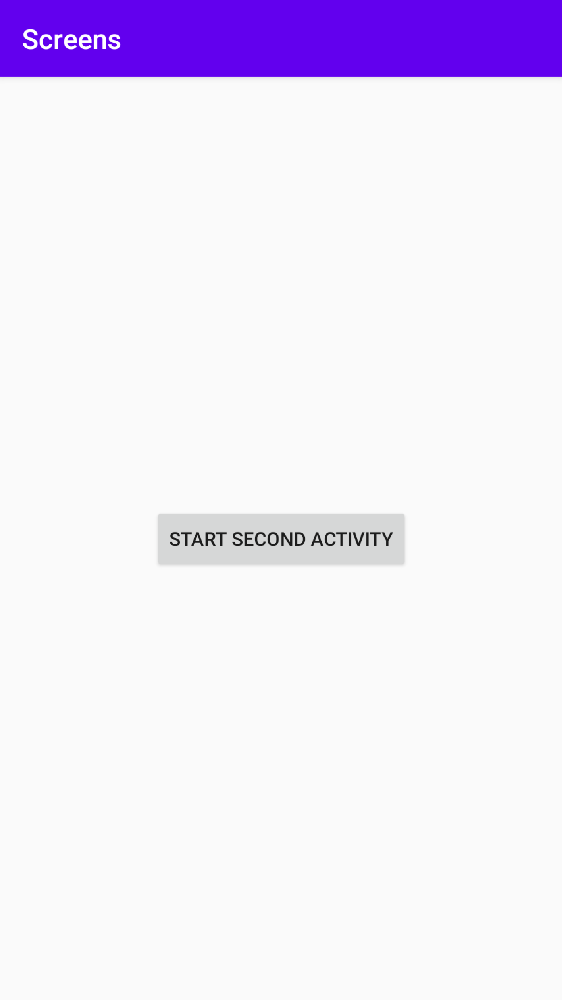
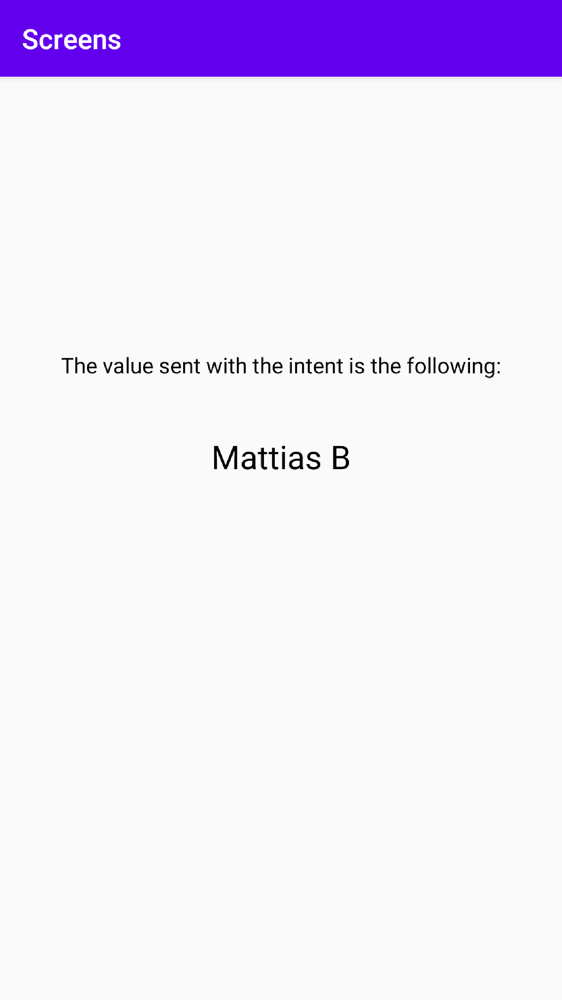

# Rapport

- [x] Add second activity: `activity_second.xml` & `SecondActivity.java`
- [x] Add button to start second activity: Added a Button in `activity_main.xml`, bound it to a
private button variable in `MainActivity.java` and added an OnClickListener for event handling.
(next step shows code that starts the second activity)

```
button = findViewById(R.id.button);
button.setOnClickListener(new View.OnClickListener() {
    @Override
    public void onClick(View view) {
            buttonClick();
    }
});
```



- [x] Add data to the intent bundle: Complemented the code that starts the second activity with an
extra that stores a value, in this case it stores a String to the 'Variable' `NAME`.

```
private void buttonClick(){
    Intent intent = new Intent(this, SecondActivity.class);
    intent.putExtra("NAME", "Mattias B");
    startActivity(intent);
}
```

- [x] Add view that shows data from intent: Added two TextViews, first is set and second receives
its value from the intent.

```
final String text = getIntent().getExtras().getString("NAME");

textView = findViewById(R.id.textView2);
textView.setText(text);
```


